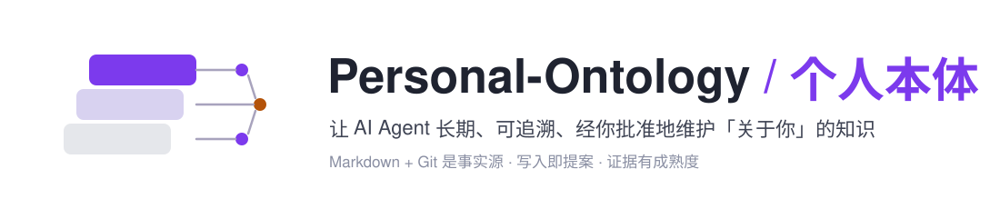
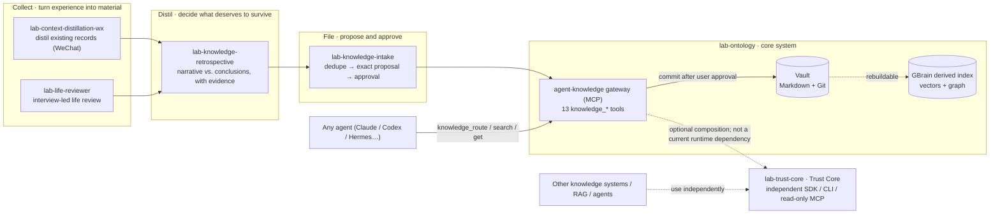

<div align="center">

<picture>
  <source media="(prefers-color-scheme: dark)" srcset="assets/banner-dark.svg">
  
</picture>

[中文](README.md) · **English**

[](https://github.com/haorantang97/Personal-Ontology/actions/workflows/ci.yml)
[](https://github.com/haorantang97/Personal-Ontology/tags)
[](LICENSE.md)


[Overview](#the-big-picture) · [Why](#how-this-differs-from-automatic-memory) · [Core system](#core-system-lab-ontology) · [Trust Core](#trust-core-lab-trust-core) · [Skills](#skills-ordered-by-the-flow-of-knowledge) · [Install](#quick-install) · [Status](#status) · [FAQ](#faq) · [Changelog](CHANGELOG.md)

</div>

**Let AI agents maintain knowledge about you — long-term, traceably, and only with your approval.**

This is an original personal-ontology workbench: one complete knowledge system (`lab-ontology`), one independently usable Trust Core (`lab-trust-core`), and four Skills around the flow of knowledge. It addresses the three chronic problems of agent memory — fragments with no structure, claims with no provenance, and silent rewrites you never approved — with three positions:

1. **Markdown and Git are the only source of truth.** Vectors, graphs and search indexes are derived layers that can be rebuilt at any time; switching engines never loses knowledge.
2. **Every write is a proposal.** Any agent can read, but none can write directly. Each change is an exact, content-baselined proposal; only after you approve it in the conversation does the gateway validate, commit to Git and rebuild the index.
3. **Evidence has boundaries; conclusions have maturity.** Where a claim came from, its sample size, its conflicts of interest and its allowed uses are fields, not rhetoric. `seed → corroborated → validated` is counted by independent source families, never by repetition.

## The big picture



Left to right is the flow of knowledge: **collect** material from existing records or interviews, let the retrospective stage **decide what deserves to survive**, then **file** it through the proposal workflow. Every agent reads through the same gateway, from the same vault.

## How this differs from "automatic memory"

Most agent-memory products are auto-writing black boxes: the model decides what matters and stores it in a database you cannot open. This repository takes the opposite road:

| | Typical auto-memory layer | Personal-Ontology |
| --- | --- | --- |
| Writes | Model decides, writes anytime | Every write is an exact proposal; nothing lands until you approve |
| Storage | Private DB / vector store | Markdown in Obsidian + Git history, readable and editable by you |
| Provenance | None | Source families, sample size, `seed → corroborated → validated` maturity |
| Retrieval | Vector similarity injects directly | Precision-first routing: similarity only ranks candidates, never triggers a read by itself |
| Portability | Tied to the service | Index and graph are derived layers, rebuildable from Markdown at any time |

The trade-off is explicit: this is heavier than "install and forget" — it runs a local gateway and index engine, and every write needs your nod. It suits people who manage personal knowledge as a long-term asset, not those who just want chat memory.

## Core system: `lab-ontology`

[Module docs](lab-ontology/README.md) · [Architecture](lab-ontology/docs/architecture.md) · [Setup](lab-ontology/docs/setup.md)

`lab-ontology` is the foundation the four skills run on. It ships three things:

- **A vault skeleton** (`lab-ontology/vault/`) you open directly in Obsidian. Knowledge is layered by *how an agent will use it later*: `.raw/` keeps recoverability and is never indexed; `sources/` holds evidence and candidate claims, retrieved on demand; `projects/ decisions/ methods/ syntheses/ concepts/` are the result layer that participates in judgment by default. The page contract lives in `ops/SCHEMA.md`, the agent rules in `ops/AGENTS.md`.
- **An MCP gateway** (`vault/ops/gateway/`) named `agent-knowledge`, exposing 13 `knowledge_*` tools: `route` / `search` / `get` / `list` / `related` for reading, `intake` / `schema` for the contract, `propose_changes` / `list_proposals` / `get_proposal` / `apply_proposal` / `reject_proposal` for the proposal workflow, and `repair_index` for the derived index. Reading is precision-first: vector similarity ranks candidates but never triggers a read on its own.
- **Governance tooling**: a vault validator, a graph sync that turns frontmatter links into typed edges, index-scope guards that keep governance files and Raw out of the index, and the GBrain schema pack `agent-decision-memory`.

It is not prompt-only: the gateway carries 30 router unit tests, and CI runs the validator, the tests and a boot probe on every push. The derived index engine (GBrain + Ollama) is an external dependency documented in setup; no personal knowledge of the author ships with the repository.

## Trust Core: `lab-trust-core`

[Trust Core docs](lab-trust-core/README.md) · [Data model](lab-trust-core/docs/model.md) · [Integration](lab-trust-core/docs/integration.md)

`lab-trust-core` receives a structured knowledge record and an intended use, returns an explainable `allow`, `review`, or `deny` verdict, and checks whether the record can advance from `seed` to `corroborated` or `validated`. It counts independent source families rather than repeated posts from the same upstream source.

It is neither a second knowledge base nor a Skill: it stores, retrieves and writes nothing, requires no `lab-ontology`, and can be embedded through its SDK, CLI or read-only MCP in any knowledge base, RAG pipeline or agent. The current `lab-ontology` snapshot still applies its own schema, agent rules and partial validation and does not declare `lab-trust-core` as a runtime dependency; adapting them later is separate work and is not required to use the Trust Core.

## Skills, ordered by the flow of knowledge

| Stage | Skill | Input | Output | Docs |
| --- | --- | --- | --- | --- |
| Collect | `lab-context-distillation-wx` | WeChat 4.x chats, database snapshots or lawful exports | A redacted, routed, merged, acceptance-gated personal operating model and event ledger | [README](skills/lab-context-distillation-wx/README.md) |
| Collect | `lab-life-reviewer` | Your own narration plus related materials | Per-event Raw records and structured handoffs, archived after approval | [README](skills/lab-life-reviewer/README.md) |
| Distil | `lab-knowledge-retrospective` | A finished task, incident, interview or long conversation | Few reusable conclusions with evidence and sample size (zero by default) | [README](skills/lab-knowledge-retrospective/README.md) |
| File | `lab-knowledge-intake` | Anything already deemed worth keeping | One exact proposal; the gateway writes it after approval | [README](skills/lab-knowledge-intake/README.md) |

**`lab-context-distillation-wx`** is the heaviest of the four: a deterministic local Python pipeline. Collection, decryption adaptation and identity redaction stay on your machine; the model only sees sealed, redacted packets. It is at v2.0.1 with 150 tests on synthetic/public fixtures and deliberately claims no real-device compatibility with any specific WeChat build until that build passes the field checklist.

**`lab-life-reviewer`** collects what records never captured: you narrate, the agent probes event by event, checks related materials, preserves Raw detail and produces a handoff. Interview and archive are two sequential tasks connected by files — the archive task never relies on remembering the interview chat.

**`lab-knowledge-retrospective`** stands between collection and filing and answers "what did this teach us". It fetches the current method pages first, separates narrative from transferable conclusions, attaches evidence, sample size and `evidence_status`, then filters against the conjunctive bar in `AGENTS.md`. Most retrospectives correctly produce zero new pages.

**`lab-knowledge-intake`** is the thinnest and the only entry point: it calls `knowledge_intake` for the contract, dedupes, drafts an exact proposal and stops for your approval. It defines no schema, picks no destination and never writes files.

All four are provider-neutral: Codex, Claude Code and any MCP client share the same `SKILL.md`, differing only in install location.

## Status

| Component | Status | Verified by |
| --- | --- | --- |
| `lab-ontology` | Snapshot of a system running daily on the author's vault (gateway 1.6.0, schema pack 1.1.1) | 30 router unit tests, vault validator, gateway boot probe (CI) |
| `lab-trust-core` | v0.1.0, independently installable Trust Core | 50 deterministic tests, Node 20/24, typecheck, build, privacy and package verification (CI) |
| `lab-context-distillation-wx` | v2.0.1, verified within synthetic/public-fixture scope | 150 Python tests, bytecode compile, frozen contract SHA-256 (CI); real-device compatibility pending field validation |
| `lab-life-reviewer` | Working workflow skill | Skill package tests (CI); no behavioral tests |
| `lab-knowledge-retrospective` | Working router skill | Skill package and layout tests (CI) |
| `lab-knowledge-intake` | Working router skill | Skill package and layout tests (CI) |

## Quick install

The system: copy `lab-ontology/vault/` as your own vault and register its MCP gateway with your agent — steps in [lab-ontology/README.md](lab-ontology/README.md).

The Trust Core can be checked out without the other components:

```bash
git clone --filter=blob:none --no-checkout https://github.com/haorantang97/Personal-Ontology.git
cd Personal-Ontology
git sparse-checkout init --cone
git sparse-checkout set lab-trust-core
git checkout main
cd lab-trust-core && npm ci && npm run verify
```

The skills, via the community Agent Skills installer:

```bash
npx skills add haorantang97/Personal-Ontology --skill lab-context-distillation-wx
npx skills add haorantang97/Personal-Ontology --skill lab-life-reviewer
npx skills add haorantang97/Personal-Ontology --skill lab-knowledge-retrospective
npx skills add haorantang97/Personal-Ontology --skill lab-knowledge-intake
```

Copying the complete skill directory works too. Codex, Claude Code, direct use and uninstall instructions live in each module's README.

## FAQ

**Does it work without GBrain and Ollama?** The gateway starts, returns the contract and manages proposals, but search, routing and approved writes need them. Both are free local software; see [setup](lab-ontology/docs/setup.md).

**Does my data leave my machine?** No. The vault, the index and the approval records are all local; the repository publishes only the system and CI scans for private-path leaks.

**How does this relate to mem0 / Basic Memory?** Same problem space, different stance: they optimize for frictionless automatic memory; this optimizes for an auditable knowledge asset — approval-gated writes and evidence maturity. They can coexist.

**Why are the skills so thin?** The schema, routing and approval rules come from the gateway's `knowledge_intake` response; skills only route the agent there. Every host writes the same format, and the schema evolves without republishing skills.

**Can I use it commercially?** `lab-trust-core/` is MIT-licensed and may be used commercially under that license. The rest of the repository is free for personal and noncommercial use; commercial use needs a written license — see below.

## License

Except for the explicit exception below, the repository uses the [PolyForm Noncommercial License 1.0.0](LICENSE.md): free to view, use, modify and distribute for personal and noncommercial purposes; any commercial use requires a separate written license from the copyright holder. **Exception: `lab-trust-core/` is independently licensed under the [MIT License](lab-trust-core/LICENSE); the repository-root PolyForm terms do not replace that license.** Third-party components are listed in [THIRD_PARTY_NOTICES.md](THIRD_PARTY_NOTICES.md).
