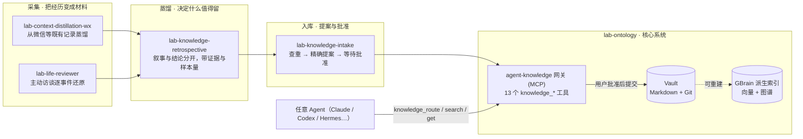

# Personal-Ontology / 个人本体

[](https://github.com/haorantang97/Personal-Ontology/actions/workflows/ci.yml)


**让 AI Agent 长期、可追溯、经你批准地维护"关于你"的知识。**

这是一个原创的个人本体工作台：一个知识系统（`lab-ontology`）加四个围绕它工作的 Skill。它解决的是 Agent 记忆的三个老问题——记得零散、来源不可追、还会在你不知情时被改写。这里的答案是三条立场：

1. **Markdown 与 Git 是唯一事实源。** 向量库、关系图、检索索引都是可以随时从 Markdown 重建的派生层；换引擎不丢知识。
2. **写入即提案。** 任何 Agent 都能读，但没有谁能直接写。每次改动都是一份精确到文件内容基线的提案，只有你在当前对话里明确批准，网关才会校验、提交 Git、重建索引。
3. **证据有边界，结论有成熟度。** 一条观点从哪来、样本多大、利益关系如何、允许用在哪，都是字段而不是修辞；`seed → corroborated → validated` 按独立来源家族计，不按重复次数投票。

## 全景



从左到右就是知识的流向：先从既有记录或主动访谈里**采集**材料，再由复盘环节**决定什么值得留下**，最后经提案流程**入库**。所有 Agent 读知识都走同一个网关，读到的是同一份 Vault。

## 核心系统：`lab-ontology`

[打开模块文档](lab-ontology/README.md) · [架构说明](lab-ontology/docs/architecture.md) · [安装指南](lab-ontology/docs/setup.md)

`lab-ontology` 是整个仓库的地基，其他四个 Skill 都运行在它之上。它包含三样东西：

- **一个 Vault 骨架**（`lab-ontology/vault/`），可以直接用 Obsidian 打开。知识按"未来如何被 Agent 使用"分三层：`.raw/` 只保可复原、从不进索引；`sources/` 存证据与候选观点，按需检索；`projects/ decisions/ methods/ syntheses/ concepts/` 是默认参与判断的结果层。页面契约写在 `ops/SCHEMA.md`，Agent 行为规则写在 `ops/AGENTS.md`。
- **一个 MCP 网关**（`vault/ops/gateway/`），名为 `agent-knowledge`，暴露 13 个 `knowledge_*` 工具：`route` / `search` / `get` / `list` / `related` 负责读，`intake` / `schema` 返回契约，`propose_changes` / `list_proposals` / `get_proposal` / `apply_proposal` / `reject_proposal` 负责提案与审批，`repair_index` 负责修复派生索引。读取是"精确优先"的：向量相似度只排序候选，从不单独触发读取。
- **一套治理工具**：Vault 校验器、由 frontmatter 链接生成带类型图谱边的同步器、防止治理文件和 Raw 泄入索引的范围守卫，以及一个 GBrain schema pack（`agent-decision-memory`）。

它不是 prompt-only 的：网关有 30 个路由单测，CI 会在每次提交时跑校验器、单测和启动探针。派生索引引擎（GBrain + Ollama）是外部依赖，按 setup 文档安装；仓库里只有系统，没有作者的任何个人知识。

## Skills（按知识流向排序）

| 阶段 | Skill | 输入 | 产出 | 文档 |
| --- | --- | --- | --- | --- |
| 采集 | `lab-context-distillation-wx` | 微信 4.x 聊天、数据库快照或标准导出 | 经脱敏、路由、归并、验收的个人运作模型与事件账本 | [打开 Skill 文档](skills/lab-context-distillation-wx/README.md) |
| 采集 | `lab-life-reviewer` | 你的主动讲述 + 与当前主题相关的材料 | 逐事件的 Raw 记录与结构化 handoff，批准后归档 | [打开 Skill 文档](skills/lab-life-reviewer/README.md) |
| 蒸馏 | `lab-knowledge-retrospective` | 一段已经结束的任务、事故、访谈或长对话 | 少量带证据与样本量的可复用结论（默认为零） | [打开 Skill 文档](skills/lab-knowledge-retrospective/README.md) |
| 入库 | `lab-knowledge-intake` | 任何已决定要保留的材料：链接、文件、文本、结论 | 一份精确提案；批准后由网关写入 Vault | [打开 Skill 文档](skills/lab-knowledge-intake/README.md) |

**`lab-context-distillation-wx`** 是四个里最重的一个：一条确定性的本地 Python 流水线，负责从既有记录里提取。它把采集、解密适配、身份脱敏留在本机，只让模型看到密封过的、脱敏的数据包；每条路由恰好产生一个处理结果，事件各自带语义状态，完整事件账本是权威，重要性只影响展示、不删除事件。当前状态是 v2.0.1，在合成/公开 fixture 上通过 150 个测试；它**不**宣称与任何具体微信构建的真机兼容，没有通过现场清单之前也不应该这样宣称。

**`lab-life-reviewer`** 从另一头补上记录里没有的东西：由你主动讲，Agent 逐事件追问、核对相关材料、保留 Raw 细节，再形成交接包。采访和归档是同一个 Skill 里前后衔接的两个任务，用文件交接，归档任务不能依赖对采访聊天的记忆。它不会把复杂经历压成一行时间线，也不会把解释当成事实。

**`lab-knowledge-retrospective`** 站在采集与入库之间，回答"这次有什么值得留下"。它先去 Vault 取当前的方法页再开始，把过程叙述和可迁移结论分开，给每条结论标上依据、样本量和 `evidence_status`，然后按 `AGENTS.md` 的合取门槛筛。大多数复盘正确的结果是零新增——一条勉强及格的页面会污染检索，比没有更贵。

**`lab-knowledge-intake`** 是最薄的一个，也是唯一的入口：任何材料想进 Vault，都由它先调 `knowledge_intake` 取契约、查重、生成精确提案，然后停下来等你批准。它自己不定义 Schema、不选存放位置、从不直接写文件；Schema 演进发生在网关里，Skill 不需要重新发布。

四个 Skill 都是厂商与模型无关的：Codex、Claude Code 和任何 MCP 客户端共用同一份 `SKILL.md`，只是安装位置不同。

## 一次完整的流转

以一次人生回顾为例：`lab-life-reviewer` 在采访任务里记录一段职业经历，生成 Raw 和 handoff；归档任务读取它们，调用 `lab-knowledge-retrospective` 把叙事里能跨时间成立的结论挑出来——也许只有一条，也许没有；有结论时交给 `lab-knowledge-intake`，它先在 Vault 里检索有没有同义页面，再生成一份提案：新建一张 `source` 页记录出处与候选观点，或更新一张既有的 `project` 页。你看到的是原文级别的改动，批准后网关在临时工作树里跑校验，只提交这几个文件，同步 GBrain 索引并重建图谱边。从此任何 Agent 在相关任务开始时，都能通过 `knowledge_route` 读到这条结论，并看到它是 `seed` 还是已被多个独立来源 `corroborated`。

## 各模块状态

| 模块 | 状态 | 验证方式 |
| --- | --- | --- |
| `lab-ontology` | 作者 Vault 上每日运行的系统快照（网关 1.6.0，schema pack 1.1.1） | 30 个路由单测、Vault 校验器、网关启动探针（CI） |
| `lab-context-distillation-wx` | v2.0.1，合成/公开 fixture 范围内验证 | 150 个 Python 测试、字节码编译、冻结契约 SHA-256（CI）；真机兼容待现场验证 |
| `lab-life-reviewer` | 可用的工作流 Skill | Skill 包结构测试（CI）；无行为测试 |
| `lab-knowledge-retrospective` | 可用的路由 Skill | Skill 包结构测试、布局测试（CI） |
| `lab-knowledge-intake` | 可用的路由 Skill | Skill 包结构测试、布局测试（CI） |

## Quick install

系统本体：复制 `lab-ontology/vault/` 作为你自己的 Vault，把其中的 MCP 网关注册到 Agent，步骤见 [lab-ontology/README.md](lab-ontology/README.md)。

Skill 用社区 Agent Skills 安装器按需安装：

```bash
npx skills add haorantang97/Personal-Ontology --skill lab-context-distillation-wx
npx skills add haorantang97/Personal-Ontology --skill lab-life-reviewer
npx skills add haorantang97/Personal-Ontology --skill lab-knowledge-retrospective
npx skills add haorantang97/Personal-Ontology --skill lab-knowledge-intake
```

也可以只复制对应的完整 Skill 目录。Codex、Claude Code、直接使用和卸载说明都在各模块 README 中。

## 仓库结构

```text
Personal-Ontology/
├── README.md                      # 本页：介绍与目录
├── CONTRIBUTING.md · CHANGELOG.md
├── LICENSE.md · THIRD_PARTY_NOTICES.md
├── lab-ontology/                  # 核心系统
│   ├── README.md · docs/          # 模块手册、架构、安装
│   └── vault/                     # Obsidian Vault 骨架 + ops/（网关、schema、校验器）
├── skills/
│   ├── lab-context-distillation-wx/  # Python 流水线、契约、fixture、150 个测试
│   ├── lab-life-reviewer/         # 双语参考文件
│   ├── lab-knowledge-retrospective/
│   └── lab-knowledge-intake/
├── tests/                         # 布局、Skill 包结构与公开边界测试
└── .github/workflows/ci.yml
```

## Repository rules

- 根 README 负责介绍与目录，不重复具体 Skill 或系统模块的操作手册。
- Skill 默认保持厂商与模型无关；不同 Agent 只使用不同安装位置。
- 每个模块单独声明验证状态、隐私边界和第三方依赖。
- Raw 访谈、聊天原文、身份、密钥与个人证据必须保存在仓库之外；`lab-ontology/vault/` 永远是空骨架。
- 任何知识库写入都必须保留精确提案和用户批准门。
- 公开 fixture 通过不等于真实设备或具体微信小版本兼容。
- 全库不得出现私人绝对路径；`tests/` 会在 CI 中扫描。
- 中文为主：README 用中文撰写并在末尾附英文摘要；代码、提交信息与 CI 用英文。
- 不直接向 `main` 推送：每项工作开分支、走 PR、CI 全绿后合并，同一时间一个会话只动一个模块。详见 [CONTRIBUTING.md](CONTRIBUTING.md)，变更记录见 [CHANGELOG.md](CHANGELOG.md)。

## License

本仓库采用 [PolyForm Noncommercial License 1.0.0](LICENSE.md)：个人与非商业用途（个人学习、研究、实验、爱好项目，以及慈善、教育、公共研究、公共安全与健康、环保、政府机构的使用）可自由查看、使用、修改和分发；任何商业用途需另行取得著作权人的书面授权。各模块不再单独维护许可文本，其 `LICENSE.md` 只指向根目录。第三方组件见 [THIRD_PARTY_NOTICES.md](THIRD_PARTY_NOTICES.md)。

---

## English summary

Personal-Ontology is an original workbench for letting AI agents maintain knowledge *about you* over the long run — traceably, and only with your approval. It consists of one system and four skills.

**`lab-ontology`** is the foundation: a schema-governed Obsidian vault skeleton (Markdown + Git as the only source of truth), an MCP gateway named `agent-knowledge` that exposes 13 `knowledge_*` tools for precision-first reading and proposal-gated writing, and the validators, graph sync and index guards around them. Vectors and graph edges live in a rebuildable derived layer (GBrain + Ollama).

The skills follow the flow of knowledge. **`lab-context-distillation-wx`** extracts an evidence-bounded personal operating model from existing records (WeChat 4.x exports) with a deterministic local pipeline; **`lab-life-reviewer`** collects what records never captured through interview-led life review; **`lab-knowledge-retrospective`** decides what from a finished piece of work deserves to survive, with evidence and sample size attached and zero new pages as the default; **`lab-knowledge-intake`** is the single entry point that turns anything worth keeping into an exact proposal and waits for approval.

The repository root is a catalog; each module contains its authoritative installation, privacy, validation and usage documentation. No private interview content, personal evidence pages or assets are published here.
