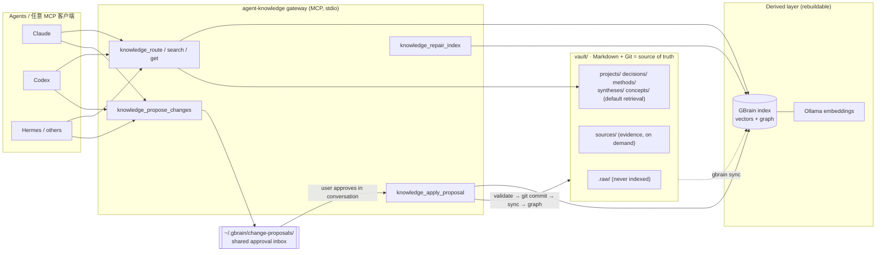

# Lab Ontology / 知识本体


`lab-ontology` 是一套面向 AI Agent 的个人知识系统：一个带严格 Schema 的 Markdown/Git Vault，一个让任意 MCP 客户端读取并“提案式”写入的网关，以及围绕它们的校验、图谱同步和索引守卫。`lab-knowledge-intake` 与 `lab-knowledge-retrospective` 两个 Skill 只是把 Agent 引到这个网关上；Schema、路由与审批规则全部由网关返回。

它不是 prompt-only 的。目录里有可运行的 MCP 服务器（13 个 `knowledge_*` 工具，含 30 个路由单测）、GBrain schema pack、Vault 校验器、图谱同步器和索引范围守卫，以及一个可以直接用 Obsidian 打开的空 Vault 骨架。

`lab-ontology` is a personal knowledge system for AI agents: a schema-governed Markdown/Git vault, an MCP gateway through which any agent reads it and *proposes* changes, and the validators, graph sync and index guards around them. Private knowledge never ships with it — the vault here is an empty skeleton.

## Architecture



**三层一规则：** 只有结果层默认参与检索；证据层按需调用；Raw 永不进入索引。**写入即提案：** 用户在当前对话里明确批准之前，任何内容都不会触碰 Vault；批准后网关在一次事务里完成校验、Git 提交、GBrain 重建索引和图谱更新。

| 层 | 位置 | 作用 | 默认检索 |
|---|---|---|---|
| Raw | `vault/.raw/` | 原始转录、导出与未清洗材料，只保证可复原 | 否，不进索引 |
| Evidence | `vault/sources/` | 出处、候选观点（`C-01…`）、来源家族独立性、成熟度、允许用途 | 按需 |
| Result | `vault/projects/` `decisions/` `methods/` `syntheses/` `concepts/` | 能直接影响未来判断与行动的结果 | 是 |

页面类型按“知识未来如何被 Agent 使用”划分，不按主题、平台或作者。可信度按 `seed → corroborated → validated` 以独立来源家族计，不按重复次数投票。`decision` 是稀少、持久、带 `revisit_when` 的承诺。完整契约见 [`vault/ops/SCHEMA.md`](vault/ops/SCHEMA.md)，Agent 规则见 [`vault/ops/AGENTS.md`](vault/ops/AGENTS.md)，更详细的设计说明见 [docs/architecture.md](docs/architecture.md)。

## Gateway tools

| Group | Tool | Behaviour |
|---|---|---|
| Read | `knowledge_route` | 精确优先的预检：返回 `read` / `review` / `none` 与可解释信号；向量相似度本身永不触发读取。 |
| Read | `knowledge_search` | 结果层全局语义检索；`module` 只加权不过滤；`scope: evidence` 才触达 Source。 |
| Read | `knowledge_get` · `knowledge_list` · `knowledge_related` | 整页、按类型/范围列表、带类型的图谱邻居。 |
| Contract | `knowledge_intake` · `knowledge_schema` | 返回 Vault 位置、当前 schema pack、路由表和强制的提案流程。**任何写入先调 `knowledge_intake`。** |
| Write | `knowledge_propose_changes` | 生成精确、带内容基线的提案（`create` / `update` / `delete` / `move` / `schema`）；不改动 Vault。 |
| Write | `knowledge_list_proposals` · `knowledge_get_proposal` | 查看共享审批收件箱。 |
| Write | `knowledge_apply_proposal` · `knowledge_reject_proposal` | 批准需显式字段与用户批准原话，目标被改动过即中止；拒绝只归档，不碰知识。 |
| Maintain | `knowledge_repair_index` | 对照当前 Git 提交重建派生索引（需要时拉起 Ollama）；永不改 Markdown 或 Git。 |

## Installation

安装的是一个**系统**，不是一个 Skill。复制 `vault/` 作为你自己的 Obsidian Vault，把其中的网关注册到任意 MCP 客户端，再按需安装两个配套 Skill。

### 1. Vault + gateway

```bash
git clone https://github.com/haorantang97/Personal-Ontology.git
cp -R Personal-Ontology/lab-ontology/vault ~/knowledge-base      # 任意没有意外的路径
cd ~/knowledge-base && git init && git add -A && git commit -m "Initialize knowledge base"
cd ops/gateway && npm ci && npm run test:router
```

Vault 必须是独立的 Git 仓库——网关以 `ops/gateway/../..` 为仓库根运行 `git`。六个内容目录名在校验器、网关和 schema pack 中写死，请保持原样。

### 2. Register with an MCP client

使用绝对路径（MCP 宿主不展开 `~`）：

```json
{
  "mcpServers": {
    "agent-knowledge": {
      "command": "node",
      "args": ["/absolute/path/to/your-vault/ops/gateway/server.mjs"],
      "env": { "GBRAIN_BIN": "/absolute/path/to/gbrain" }
    }
  }
}
```

### Codex

在 Codex 的 MCP 服务器配置中加入上面的 `agent-knowledge` 条目，然后安装 `$lab-knowledge-intake` 与 `$lab-knowledge-retrospective`（见各自 README）。

### Claude Code

```bash
claude mcp add agent-knowledge -e GBRAIN_BIN=/absolute/path/to/gbrain -- node /absolute/path/to/your-vault/ops/gateway/server.mjs
```

Claude Desktop 则编辑 `claude_desktop_config.json`。网关对所有宿主暴露同一份工具与契约，没有分叉实现。

### 3. Derived index

检索、路由与批准流程需要 [GBrain](https://github.com/garrytan/gbrain) ≥ 0.42.0（作为 CLI 被网关调用）和本地 [Ollama](https://ollama.com) embedding。注册 source、安装 schema pack、环境变量（`GBRAIN_BIN`、`GBRAIN_SOURCE_ID`、`OLLAMA_API_URL`）与升级检查见 [docs/setup.md](docs/setup.md)。

## Requirements

- Node.js ≥ 20；`npm ci` 安装 `@modelcontextprotocol/sdk` 与 `zod`。
- Git。
- Obsidian（编辑与图谱视图；非必需）。
- GBrain ≥ 0.42.0 与 Ollama：派生索引层。没有它们时网关仍能启动、返回契约、创建和列出提案，但 `knowledge_search` / `knowledge_route` / `knowledge_schema` / `knowledge_apply_proposal` / `knowledge_repair_index` 会报错。

## Verify

```bash
cd vault/ops/gateway && npm ci && npm run test:router     # 30 个路由单测，不需要 GBrain
cd ../.. && node ops/validate-vault.mjs                    # 对骨架校验通过
```

网关启动探针（不需要 GBrain）：连接 `server.mjs`，`listTools` 应返回恰好 13 个 `knowledge_*` 工具。仓库的 CI 工作流 [`ci.yml`](../.github/workflows/ci.yml) 就是跑这三步。

端到端检查 `npm run test:smoke` 需要 GBrain + Ollama 和一个有内容的 Vault；`smoke-test.mjs` 里的 `cases` 引用原始 Vault 的页面 slug，请换成你自己的页面。

## Privacy

- 本模块只发布系统：Schema、网关、校验器、空 Vault 骨架。原始 Vault 的 `.raw/` 访谈、`sources/` 证据页、项目页与资产一概不含。
- 你的 Vault 应放在本仓库之外（例如 `~/knowledge-base`）；回传系统改动时保持这一边界。
- 共享审批收件箱在 `~/.gbrain/change-proposals/`，批准记录保存在用户本机，不进入 Vault。
- `ops/`、`.raw/`、根 README 永不进入索引；`check-index-scope.mjs` 会在它们泄入索引时直接失败。
- 不运行无人值守的 `gbrain dream` / `gbrain autopilot`。

## Upgrade

用新版本替换 `vault/ops/` 下的系统文件，保留你自己的内容目录与 `.obsidian/`。按你 Vault 的规则，`ops/` 属于治理文件，应通过 `schema` 类型提案经批准后更新。升级 GBrain 后运行 `node ops/ensure-gbrain-sync-filter.mjs`、`node ops/check-index-scope.mjs` 与 `cd ops/gateway && npm test`。

## Uninstall

从 MCP 客户端配置中移除 `agent-knowledge` 条目，删除你复制出去的 Vault 目录（其中包含你的知识，请先确认已备份），并按需清理 `~/.gbrain/change-proposals/`。GBrain 与 Ollama 是独立安装的软件，按各自方式卸载。

## Troubleshooting

- `spawnSync .../gbrain ENOENT`：网关找不到 GBrain CLI，设置 `GBRAIN_BIN`。
- 批准被拒、提示目标已被改动：另一个 Agent 在提案之后改了同一页面，重新查重并重新提案。
- 批准被拒、提示存在已暂存改动：Vault 里有 `git add` 过但未提交的内容，先提交或撤销暂存。
- 批准成功但 `index_status = failed`：调用 `knowledge_repair_index`，不要让 Agent 手动跑 `gbrain`。

## License

本模块采用“公开可查看、个人非商业使用”的[许可草案](LICENSE.md)。商业使用、企业部署、客户交付、再包装或再分发需要权利人的书面授权；正式公开发布前仍需律师复核。第三方组件见 [THIRD_PARTY_NOTICES.md](THIRD_PARTY_NOTICES.md)。

## Provenance

`vault/ops/` 是作者本地 Vault 治理层的快照（gateway 1.6.0，schema pack `agent-decision-memory` 1.1.1）。相对原件只做了两处可移植性修改：`server.mjs` 与 `sync-graph.mjs` 中 `GBRAIN_BIN` 的默认值从作者机器的绝对路径改为 `~/.bun/bin/gbrain`，`ops/gateway/README.md` 中的示例路径改为占位符。`vault/README.md` 是原 Vault 的根 README，保持原样。
