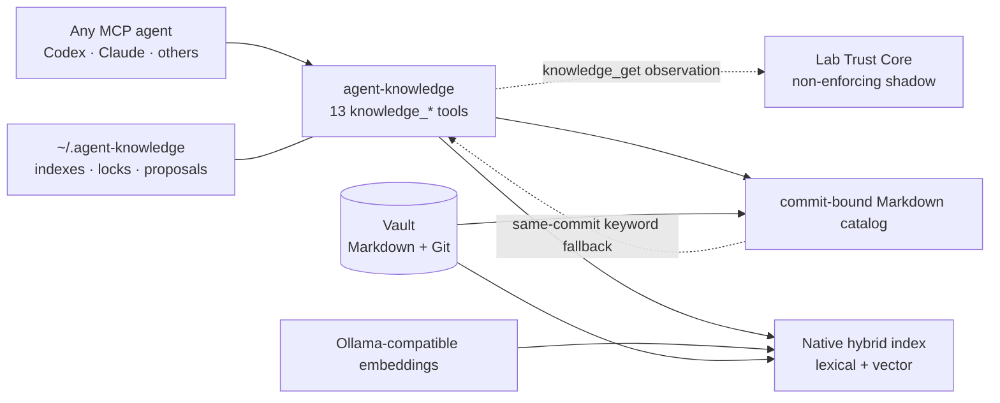

# Lab Ontology / 知识本体


`lab-ontology` is a portable personal-knowledge system for AI agents. It combines an empty Markdown/Git Vault, a 13-tool MCP gateway named `agent-knowledge`, a Native hybrid retrieval index, deterministic same-commit fallback, schema and Vault validators, and exact proposal-gated writes. No personal knowledge ships with the module.

`lab-ontology` 是一套可移植的 AI Agent 个人知识系统：空的 Markdown/Git Vault、名为 `agent-knowledge` 的 13 工具 MCP 网关、Native 混合检索索引、同一 Git 提交上的确定性回退、Schema/Vault 校验，以及精确提案审批写入。模块不包含作者的个人知识。

## Architecture / 架构



The core invariant is simple: **Markdown and Git are the only facts.** Every read is tied to one immutable Git commit. Native index generations are rebuildable state outside the Vault. If the embedding service or an index arm is unavailable, search can fall back to deterministic keyword recall over the same committed Markdown and reports the degradation explicitly.

核心不变量只有一句：**Markdown 与 Git 是唯一事实源。** 每次读取绑定到一个不可变 Git 提交。Native 索引位于 Vault 外，可以重建；向量服务或索引分支不可用时，系统会在同一提交的 Markdown 上做确定性关键词回退，并明确报告降级，而不是伪装成完整语义检索。

### Three knowledge layers / 三层知识

| Layer | Location | Role | Default retrieval |
|---|---|---|---|
| Raw | `vault/.raw/` | recoverable transcripts, exports and uncleaned material | never indexed |
| Evidence | `vault/sources/` | provenance, candidate claims, conflicts and usage boundaries | on demand |
| Result | `vault/projects/`, `decisions/`, `methods/`, `syntheses/`, `concepts/` | state and conclusions that can change future judgment or action | yes |

Pages are classified by future Agent use, not author, platform or topic. `modules` boost relevant pages without creating hard walls. Maturity progresses `seed → corroborated → validated` through independent evidence families, not repeated claims from the same source.

完整页面契约见 [`vault/ops/SCHEMA.md`](vault/ops/SCHEMA.md)，Agent 行为规则见 [`vault/ops/AGENTS.md`](vault/ops/AGENTS.md)，实现说明见 [docs/architecture.md](docs/architecture.md)。

## MCP tools / MCP 工具

| Group | Tools | Contract |
|---|---|---|
| Read | `knowledge_route`, `knowledge_search`, `knowledge_get`, `knowledge_list`, `knowledge_related` | Precision-first routing; result scope by default; exact committed reads and typed relations. |
| Contract | `knowledge_intake`, `knowledge_schema` | Return the current schema, routing and mandatory workflow. Every requested write begins with `knowledge_intake`. |
| Proposal | `knowledge_propose_changes`, `knowledge_list_proposals`, `knowledge_get_proposal`, `knowledge_apply_proposal`, `knowledge_reject_proposal` | Draft, inspect, explicitly approve or archive exact content-baselined changes. |
| Maintain | `knowledge_repair_index` | Rebuild or verify Native derived state against current Git `HEAD`; never edit Markdown or Git. |

Vector similarity can rank candidates but cannot alone trigger `action: read`. `action: review` is a weak-candidate signal, not permission to treat a title or summary as fact. Exact page reads and contract reads do not depend on a healthy vector service.

`knowledge_propose_changes` now validates the complete candidate tree before it
creates a pending proposal. Invalid Markdown, schema, relationships or gateway
changes return a structured `proposal_preflight` error and never enter the
approval queue. Both YAML flow lists and ordinary block lists are accepted.
Project lifecycle uses optional `project_status`; record availability remains in
`status`. Evidence `maturity` and retrieval `agent_priority` are independent.

## Trust Core shadow / Trust Core 影子观测

Agent Knowledge 1.8.0 pins the public `lab-trust-core` release in its lockfile. After an allowed `knowledge_get`, the gateway can attach a bounded `trust_shadow` diagnostic to the returned committed record.

This is deliberately **non-enforcing** in 1.8.0. Trust Core cannot block a read, change a router action, upgrade maturity, authorize a write or make the gateway unavailable. A legacy page that only lacks the newer trust fields is labeled `legacy_migration_warning` / `legacy_unmigrated` with `blocking: false`; it is not a write failure and does not mean the content is false. An unavailable or incompatible core is reported as a diagnostic. The standalone Trust Core can still be used independently outside `lab-ontology`.

## Install / 安装

Install the system, not only a Skill:

```bash
git clone https://github.com/haorantang97/Personal-Ontology.git
cp -R Personal-Ontology/lab-ontology/vault knowledge-vault
cd knowledge-vault
git init
git add -A
git commit -m "Initialize knowledge vault"
cd ops/gateway
npm ci
```

The copied Vault must be an independent Git repository. Register its gateway with an MCP client using an absolute path:

复制出的 Vault 必须是独立 Git 仓库。下面所有命令都要把示例路径替换成该 Vault 的绝对路径。

Runtime state contains `indexes/`, `locks/` and `proposals/`. Assign every independent Vault its own absolute `AGENT_KNOWLEDGE_STATE_DIR`; otherwise multiple Vaults can accidentally share the default proposal queue at `~/.agent-knowledge/`.

运行状态包含索引、锁和提案。每个独立 Vault 都应设置独立的 `AGENT_KNOWLEDGE_STATE_DIR`，不要让多个 Vault 共用默认的 `~/.agent-knowledge/` 提案队列。

### Codex

Register the stdio server with the official Codex CLI; Codex writes the entry to `~/.codex/config.toml`:

```bash
codex mcp add agent-knowledge -- node /absolute/path/to/knowledge-vault/ops/gateway/server.mjs
```

For the required per-Vault state isolation, include its dedicated state directory when registering:

```bash
codex mcp add \
  --env AGENT_KNOWLEDGE_STATE_DIR=/absolute/path/to/state/my-knowledge-vault \
  agent-knowledge \
  -- node /absolute/path/to/knowledge-vault/ops/gateway/server.mjs
```

Codex 使用 CLI 注册 MCP，不使用下方的 `mcpServers` JSON。配置会写入 `~/.codex/config.toml`；注册后重启或重新加载 MCP 服务。可选的 `lab-knowledge-intake` 与 `lab-knowledge-retrospective` Skills 只提供触发指引，不能替代网关契约。

### Claude Code

```bash
claude mcp add agent-knowledge \
  -e AGENT_KNOWLEDGE_STATE_DIR=/absolute/path/to/state/my-knowledge-vault \
  -- node /absolute/path/to/knowledge-vault/ops/gateway/server.mjs
```

Claude Code 同样通过 CLI 注册。Claude Desktop 或其他采用 JSON 配置的 MCP 客户端可使用下面的通用示例；这段 JSON **不适用于 Codex**：

```json
{
  "mcpServers": {
    "agent-knowledge": {
      "command": "node",
      "args": ["/absolute/path/to/knowledge-vault/ops/gateway/server.mjs"],
      "env": {
        "AGENT_KNOWLEDGE_STATE_DIR": "/absolute/path/to/state/my-knowledge-vault"
      }
    }
  }
}
```

The gateway itself is host-neutral; only the host's registration format differs.

### Native embeddings

Full hybrid retrieval and index rebuilds use an Ollama-compatible `/api/tags` and `/api/embed` service. The reference defaults are `http://127.0.0.1:11434`, `qwen3-embedding:0.6b`, and 1024 dimensions:

```bash
ollama pull qwen3-embedding:0.6b
ollama serve
```

Then call `knowledge_repair_index({"force_full": true})` through MCP. A live embedding service is optional for boot, deterministic unit tests, exact reads and degraded keyword fallback; it is required to build and query the vector arm.

See [docs/setup.md](docs/setup.md) for the complete installation, verification and privacy boundary.

## Verify / 验证

The deterministic verification path uses only synthetic fixtures and no live Ollama process:

```bash
cd vault/ops/gateway
npm ci
npm run test:unit
npm run validate:schema
cd ../..
node ops/validate-vault.mjs
```

The MCP boot probe must return exactly 13 named `knowledge_*` tools. Repository CI runs these checks on Node 20 and 24 inside a temporary, independently initialized Git Vault so a passing catalog checkout cannot hide a missing Vault precondition. `npm run test:smoke` creates its own temporary synthetic Vault and verifies the same-commit keyword fallback without a live embedding service. A real compatible service is reserved for an optional manual integration check.

Passing deterministic tests and the boot probe demonstrates structure, contracts and isolated behavior; it does not claim that a user's local embedding service, MCP host configuration or private corpus has been exercised.

这些检查通过，只能证明代码结构、契约和隔离测试成立；仍需在实际客户端确认 13 个工具可见，并按需重建真实 Vault 的向量索引。

## Exact proposal gate / 精确提案门

An Agent may search and draft without approval, but cannot directly create, update, move or delete knowledge. The enforced sequence is:

1. Call `knowledge_intake` for the current contract.
2. Search and read existing pages to avoid duplicates.
3. Call `knowledge_propose_changes` with complete target contents and exact actions.
4. Show the proposal and wait for explicit approval of that proposal.
5. Call `knowledge_apply_proposal` with the approval record.

The gateway rechecks every target baseline, validates the proposed tree, commits only approved targets and synchronizes the Native index. If the index fails after the content commit, the Git commit remains authoritative and `knowledge_repair_index` repairs only derived state. A corrected or stale proposal always needs fresh approval.

中文要点：Agent 只能先生成可审查提案；用户明确批准具体提案后，才能由 `knowledge_apply_proposal` 应用。修正版或已过期提案必须重新批准，不能沿用旧批准。

## Human navigation / 人类导航

At server startup the committed catalog can regenerate a compact root `index.md` for human browsing. The file is ignored by Git and excluded from retrieval. Obsidian's folder tree and Graph View remain useful interfaces, but neither replaces this generated summary or the Agent retrieval path.

## Privacy / 隐私

- The public module contains an empty Vault skeleton, system code, neutral synthetic fixtures and documentation only.
- Keep the working Vault outside this catalog repository. Personal Markdown, Raw, assets, proposals and generated indexes must not be committed here.
- `.raw/`, `ops/`, root governance documents and generated `index.md` never enter the retrieval corpus.
- Trust shadow receives only the bounded committed record being returned; it is not a second knowledge store.

中文要点：公开仓库只放空骨架、代码、合成测试数据和文档。个人页面、Raw、资产、提案与运行索引应留在独立 Vault 和专属状态目录中，不得提交到本目录。

## Upgrade / 升级

Back up the working Vault, replace the system files under `vault/ops/` with the newer release, run deterministic verification, restart the MCP server, then call `knowledge_repair_index({"force_full": true})`. In a governed Vault, system-file changes use a separate exact schema/governance proposal rather than being bundled with content.

## Uninstall / 卸载

Remove the `agent-knowledge` MCP entry. Back up any personal content before deleting the copied Vault. The rebuildable runtime directory `~/.agent-knowledge/` can be removed separately after confirming that proposal receipts are no longer needed. Ollama is an independent application and is uninstalled separately.

## Troubleshooting / 故障排查

- **Server refuses to start:** confirm the Vault has a Git commit, run `npm ci`, and run `npm run validate:schema`.
- **Search reports degraded:** the same-commit keyword fallback is active. Start the compatible embedding service and call `knowledge_repair_index({"force_full": true})` to restore full hybrid retrieval.
- **Proposal is stale:** a target changed after proposal creation. Recreate the exact proposal and obtain fresh approval.
- **Approved commit reports an index failure:** keep the committed Markdown as fact and call `knowledge_repair_index`; do not hand-edit runtime index files.
- **Trust shadow reports unavailable:** page delivery remains valid in shadow mode. Re-run `npm ci` and the Trust Core live test before treating it as an integration fault.

## License and provenance / 许可与来源

This module uses the repository's [PolyForm Noncommercial License 1.0.0](LICENSE.md). The separately packaged `lab-trust-core` dependency retains its MIT license. See [THIRD_PARTY_NOTICES.md](THIRD_PARTY_NOTICES.md).

`vault/ops/` is the Agent Knowledge 1.8.0 Native-only reference implementation published with neutral fixtures. Its proposal-time preflight, YAML list handling, lifecycle/priority semantics and Trust Core migration diagnostics are synchronized with the working Vault. The public copy retains neutral example paths, synthetic smoke cases, configurable runtime-state locations and the public Trust Core 0.1.2 lock; it intentionally omits personal pages, paths, query cases, proposal history and runtime state.
