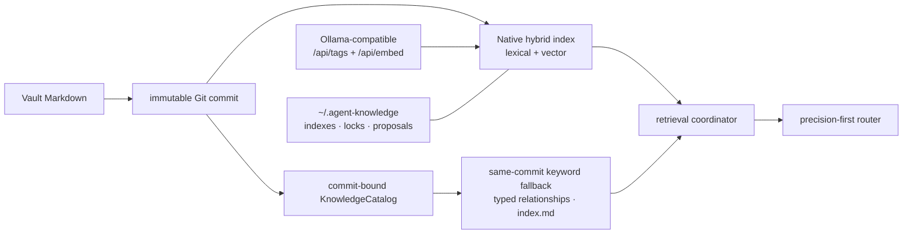
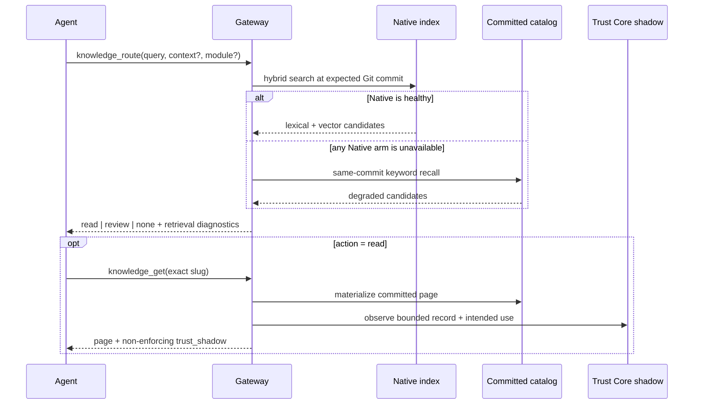
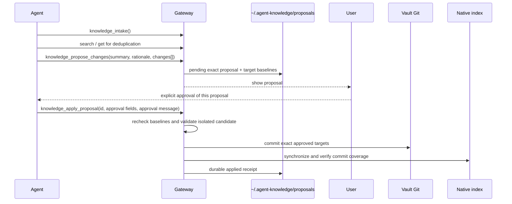

# Architecture / 架构说明

This page explains how Agent Knowledge 1.8.0 keeps canonical Markdown separate from rebuildable retrieval state. The normative contracts are `vault/ops/SCHEMA.md` (page model) and `vault/ops/AGENTS.md` (agent behaviour).

本页说明 Agent Knowledge 1.8.0 如何把正式 Markdown 与可重建检索状态分开。规范性契约在 `vault/ops/SCHEMA.md`（页面模型）和 `vault/ops/AGENTS.md`（Agent 行为）。

## 1. Source of truth and derived state / 事实源与派生状态

- **Markdown and Git are the only facts.** Reads, schema responses and retrieval metadata are materialized from one immutable Git commit. Uncommitted working-tree content is not silently served.
- **The Native index is disposable.** Its generations live outside the Vault under `~/.agent-knowledge/indexes/native/` by default and are bound to a source commit, schema fingerprint, corpus fingerprint and embedding-model identity.
- **The fallback is commit-bound too.** If the Native vector or lexical arm is unhealthy, policy v2 selects `local_markdown_keyword`: deterministic keyword recall over the same committed Markdown catalog. The response reports `retrieval_status: degraded`; fallback does not pretend to preserve vector quality.
- **Relationships remain Markdown facts.** Frontmatter links are normalized by the local catalog into typed outgoing and incoming relationships. No separate graph database is authoritative.
- **`index.md` is navigation, not knowledge.** The catalog can regenerate a compact human index from the committed pages. It is excluded from retrieval and never becomes a second fact source.

## 2. Three knowledge layers / 三层知识

| Layer | Directory | Default retrieval | Purpose |
|---|---|---|---|
| Raw | `.raw/` | never indexed | recoverable transcripts, exports and uncleaned material |
| Evidence | `sources/` | only with `scope: evidence` or `all` | provenance, candidate claims, conflicts and allowed uses |
| Result | `projects/` `decisions/` `methods/` `syntheses/` `concepts/` | yes | reusable state, commitments, procedures, conclusions and mechanisms |

Raw → Source → Result is many-to-many. One Raw item may yield no Source; one Source may contain several stable claim IDs; one result page may cite several independent source families. The architecture never creates pages merely to preserve a one-to-one count.

## 3. Page types by future use / 按未来用途分类

| Type | Enter when |
|---|---|
| `project` | Living current truth: objectives, constraints, confirmed state and pending items. |
| `decision` | A rare durable commitment with rationale, rejected alternatives, scope and `revisit_when`. |
| `methodology` | A repeatable procedure with inputs, steps, outputs, boundaries and failure conditions. |
| `synthesis` | Independent evidence converges on a conclusion that narrows choices. |
| `concept` | A stable mechanism used repeatedly in judgment and not better represented elsewhere. |
| `source` | Curated evidence or candidate claims with provenance, maturity and usage limits. |

Classification follows how an Agent will use the page later, not its author, platform or file format. `domain`, `tags`, `modules`, `source_format` and `status` provide horizontal organization.

## 4. Trust, independence and maturity / 可信度、独立性与成熟度

`maturity` is `seed`, `corroborated` or `validated`.

- `seed`: one source or one event. It may suggest an experiment, question or expression pattern, but cannot be the sole basis for a stable fact or high-risk decision.
- `corroborated`: at least one genuinely independent source family, independent event or the user's own run converges.
- `validated`: repeated runs, controls or high-quality evidence support the claim inside an explicit scope.

Repeated posts from the same author, institution, citation chain or upstream source remain one source family. Conflicts are preserved rather than averaged away.

`lab-trust-core` is installed as a pinned package and called only after an allowed `knowledge_get`. It emits a bounded `trust_shadow` diagnostic tied to the returned committed Markdown. In 1.8.0 shadow mode it is **non-enforcing**: it cannot block a page, alter routing, promote maturity, authorize a write or make the gateway unavailable. Missing or incompatible Trust Core produces a diagnostic rather than a policy decision.

## 5. Modules are weights, not walls / 模块是权重，不是墙

`modules: []` contains stable module slugs. Retrieval starts globally; a matching `module` hint boosts candidates without hiding cross-module pages. A module-specific claim becomes global only after independent evidence supports that transfer—not merely because it was repeated.

## 6. Read path / 读取路径

`knowledge_route` is precision-first: semantic similarity and module match rank candidates but never alone authorize an automatic read. `review` exposes weak candidates without turning them into facts. `none` with an unavailable retrieval status means the knowledge base could not be checked successfully, not that no relevant knowledge exists.

Direct reads—`knowledge_get`, `knowledge_list`, `knowledge_related` and schema/contract reads—come from the committed catalog and do not require a healthy vector service. They fail closed if Git `HEAD` changes while a response is being constructed.

## 7. Write path / 写入路径

The gateway enforces these boundaries:

- Each target carries its action and baseline. If the target changed after proposal creation, application stops and a new proposal needs new approval.
- Content and governance/schema changes require separate exact proposals.
- Validation runs against the proposed target tree before commit; only approved targets are staged.
- A successful content commit remains the fact even if index synchronization later fails. `knowledge_repair_index` repairs only derived state and never edits Markdown or Git.
- Rejection archives the proposal with its reason and never changes the Vault.
- Runtime state defaults to `~/.agent-knowledge/`; it is outside the Vault and is not published with personal knowledge.

## 8. The 13-tool MCP surface / 13 个 MCP 工具

| Group | Tools |
|---|---|
| Read | `knowledge_route`, `knowledge_search`, `knowledge_get`, `knowledge_list`, `knowledge_related` |
| Contract | `knowledge_intake`, `knowledge_schema` |
| Proposal | `knowledge_propose_changes`, `knowledge_list_proposals`, `knowledge_get_proposal`, `knowledge_apply_proposal`, `knowledge_reject_proposal` |
| Maintain | `knowledge_repair_index` |

The MCP server is the shared behavior layer for any compatible host. Thin Skills may prompt an Agent to call it, but they do not duplicate the schema or bypass the approval gate.

## 9. Living pages and audits / 活页面与周期审计

Project pages and any page explicitly representing current state can be updated incrementally through proposals. Updates preserve the current truth, separate confirmed state from pending items and inference, and refresh `updated` plus `last_confirmed` where required. They do not append task logs or full chats.

Periodic audits are read-only by default. They identify format drift, duplicates, contradictions, stale state, title noise, broken links and evidence-boundary violations, then produce separate reviewable proposals rather than one broad authorization.
