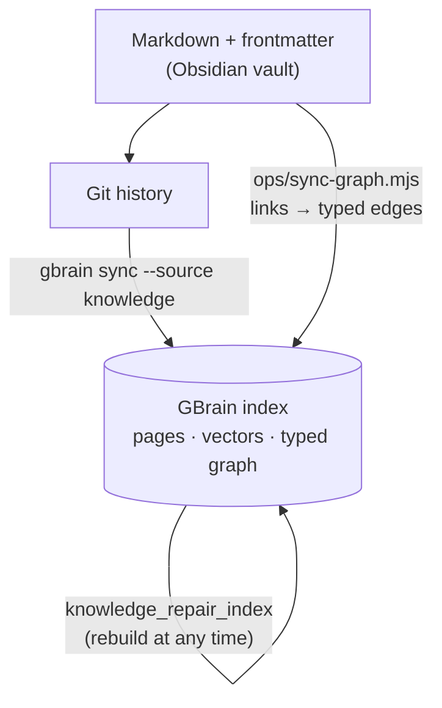
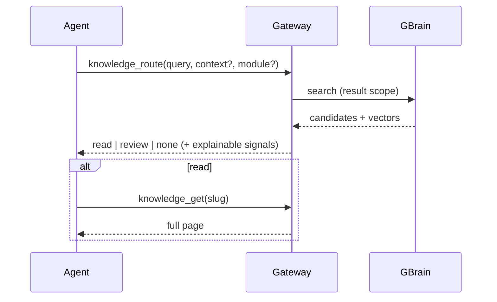
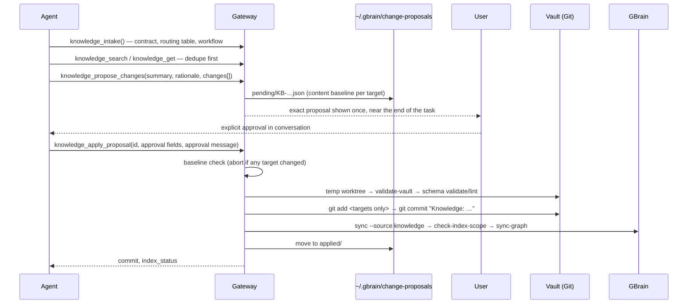

# Architecture / 架构说明

A short tour of how the pieces fit. The normative contracts are `vault/ops/SCHEMA.md` (what a page is) and `vault/ops/AGENTS.md` (how an agent behaves); this page explains *why* they are shaped that way and how the code enforces them.

本页是系统的导览。规范性契约在 `vault/ops/SCHEMA.md`（页面是什么）和 `vault/ops/AGENTS.md`（Agent 怎么做）；这里解释它们为何如此设计，以及代码如何执行。

## 1. Source of truth vs. derived layer / 事实源与派生层

- **Markdown and Git are the only facts.** Every approved change is a Git commit whose message starts with `Knowledge:`.
- **GBrain is disposable.** Vectors and graph edges are rebuilt from the Markdown; `knowledge_repair_index` verifies that the index reached the current Git commit and rebuilds edges. It never writes Markdown or Git, so it needs no approval.
- **Governance files are not knowledge.** `README.md`, `ops/`, `.raw/` and `assets/` must never enter the index. `check-index-scope.mjs` fails closed if they do, and `ensure-gbrain-sync-filter.mjs` guards the installed GBrain import walker.

## 2. Three layers / 三层

| Layer | Directory | Enters index | Typical origin |
|---|---|---|---|
| Raw | `.raw/` | never | transcripts, recordings index, screenshots text, exports, interview handoffs |
| Evidence | `sources/` | on demand (`scope: evidence`) | curated analysis of one coherent source, with numbered claims |
| Result | `projects/` `decisions/` `methods/` `syntheses/` `concepts/` | default | anything that should change a future agent's judgment or action |

Raw → Source → Result is many-to-many. One Raw can yield zero or many Sources; one Source can carry many claims (`C-01`, `C-02`, …) and support zero or many result pages; one result page can be backed by several independent Sources. A Source that never produces a result page is legitimate — it is a candidate pool, not a failure.

## 3. Page types by future use / 按未来用途分类

| Type | Enter when |
|---|---|
| `project` | Living current truth of a project: objectives, constraints, confirmed state, pending items. Updated in place by any agent via proposal; carries `last_confirmed`. |
| `decision` | A rare, durable commitment: final choice, rationale, rejected alternatives, scope, implementation location, `decision_status`, `revisit_when`. Not an approval log. |
| `methodology` | A repeatable procedure with inputs, steps, outputs, boundaries and failure conditions. |
| `synthesis` | A conclusion supported by **independent** source families that narrows choices. |
| `concept` | A stable mechanism used repeatedly in judgment and not better represented elsewhere. |
| `source` | Evidence analysis and candidate claims with provenance, source family, maturity and allowed/disallowed uses. |

Classification follows *how an agent will use the page later*, never topic, platform, author or medium. Horizontal organisation is metadata: `domain`, `tags`, `modules`, `source_format`, `status`.

## 4. Trust, independence, maturity / 可信度与独立性

`maturity` is one of `seed`, `corroborated`, `validated`.

- `seed` — one source or one event. Can feed candidate actions, interview questions, copy inspiration or experiment hypotheses; never a sole basis for stable facts or high-risk decisions.
- `corroborated` — at least one truly independent source family, independent event, or the user's own run converges.
- `validated` — repeated runs, controls or high-quality evidence within an explicit scope.

Same author, same institution, repost chains and mutual citations are **one** source family. Repetition does not promote a claim. Medical, legal, financial, stable-personality and strong-causal claims never get a lower bar because they are `seed`.

## 5. Modules are weights, not walls / 模块是权重不是墙

`modules: []` on a page is a list of stable module slugs. Retrieval is always global first; pages whose modules match the current task are boosted, cross-module hits are still returned with a note on transfer conditions. `knowledge_search` accepts a `module` hint for exactly this; it widens the candidate pool and re-ranks instead of filtering.

## 6. Read path / 读取路径

`knowledge_route` is precision-first: vector similarity and module match order candidates but never trigger a read on their own. `review` exposes weak candidates without authorising them as facts. `none` with `retrieval_status: unavailable` means *the index could not be consulted*, not *nothing exists*. The route tool persists nothing.

## 7. Write path / 写入路径

Guarantees enforced in `server.mjs`:

- A proposal records each target's content hash; approval aborts if another agent changed a target since.
- Validation and indexing run in a clean temporary worktree, so unrelated unstaged or untracked work does not block approval. Pre-existing *staged* changes do block, because Git cannot tell who staged them.
- Only the exact approved targets are staged and committed.
- `origin: background` proposals stay in the shared inbox for a dedicated review task; conversation proposals are shown once.
- Governance targets (`ops/SCHEMA.md`, `pack.json`, the gateway itself…) are only reachable through the `schema` action, which additionally runs `gbrain schema validate` / `lint`; `AGENTS.md` requires such changes to be approved separately from content.
- Accidental Obsidian UI artifacts at the vault root (`.base`, `.canvas`) can be removed only by an exact hash-pinned `delete` proposal.
- Rejection archives the proposal and never touches knowledge.

## 8. Living pages and audits / 活页面与周期审计

`project` pages (and any page explicitly marked as current state) are living documents: any agent may propose incremental updates, no agent owns a page, and the update must update `updated` (and `last_confirmed` for projects), distinguish confirmed state from pending items and agent inference, and never append task logs or chat transcripts.

Periodic audits are read-only by default. They check format, duplicates, contradictions, staleness, title pollution, broken links and evidence boundaries, and emit **separate** proposals per issue — never a single "clean everything" authorisation.

## 9. Relations / 关系

Frontmatter fields `related`, `evidence`, `derived_pages` hold quoted Obsidian links with full vault paths (`"[[methods/…]]"`). The validator normalises links, aliases and heading anchors to slugs; `sync-graph.mjs` turns them into typed edges:

| Edge | Meaning |
|---|---|
| `derived_from` / `supports` | result ↔ source evidence (must be bidirectionally consistent) |
| `applies_to` / `uses` | what a method, concept or decision applies to |
| `depends_on` / `required_by` | prerequisites |
| `contradicts` | conflicting conclusions, kept rather than auto-resolved |
| `supersedes` / `superseded_by` | a newer decision or conclusion replaces an older one |
| `related_to` | undirected adjacency between result pages |

## 10. Why skills stay thin / 为什么 Skill 刻意轻薄

`lab-knowledge-intake` and `lab-knowledge-retrospective` contain no schema. They route the agent to `knowledge_intake` (the contract) and, for retrospectives, to `knowledge_search` for the *current* method pages. Moving the contract into the MCP response means every host — Claude, Codex, Hermes — writes the same format, and the schema can evolve without re-publishing skills.
